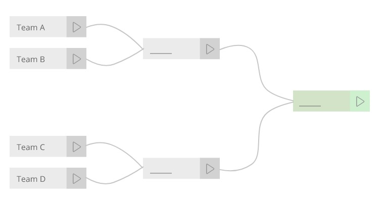

O desafio
-------------------------
Bem vindo à Summoners Rift. 

Você foi convocado a participar do mais empolgante desafio de sua vida: acabar com os intermináveis conflitos em Valoran. A nação humana de Demacia, o assombroso império de Noxus e os moradores de todas as cidades-estado aguardam ansiosamente por este momento.

Para isso ocorrerá um torneio onde o reino do vencedor terá o poder de controlar todos os outros em Valoran e precisamos que você desenvolva um sistema para gerenciar este torneio.

Regras
-------------------------
Os torneios tipicamente mata-mata são compostos por times e chaves, onde são gerados os vencedores de cada chave até chegar ao grande vencedor do torneio.
Seu objetivo é criar um sistema onde é possível cadastrar os times e gerenciar o torneio até a fase final, onde poderemos eleger o vencedor.

**Requisitos**
- [ ] Você deverá desenvolver uma solução utilizando **Angular** utilizando as dependências, tecnologias e conceitos que julgar melhor.
- [ ] Queremos como resultado uma solução simples, legível e de qualidade. 
- [ ] Código feito e comentado em **inglês**.
- [ ] Não utilize soluções prontas. Nós as conhecemos.
- [ ] Seja criativo. Você decide quais funcionalidades irá incluir além dos requisitos.
- [ ] Não hospede sua aplicação ou parte dela em nenhum lugar. Sua aplicação deverá rodar localmente sem depender de serviços externos.

Nós iremos avaliar a qualidade técnica do código CSS, HTML e Javascript além do aspecto visual e de usabilidade da aplicação.

